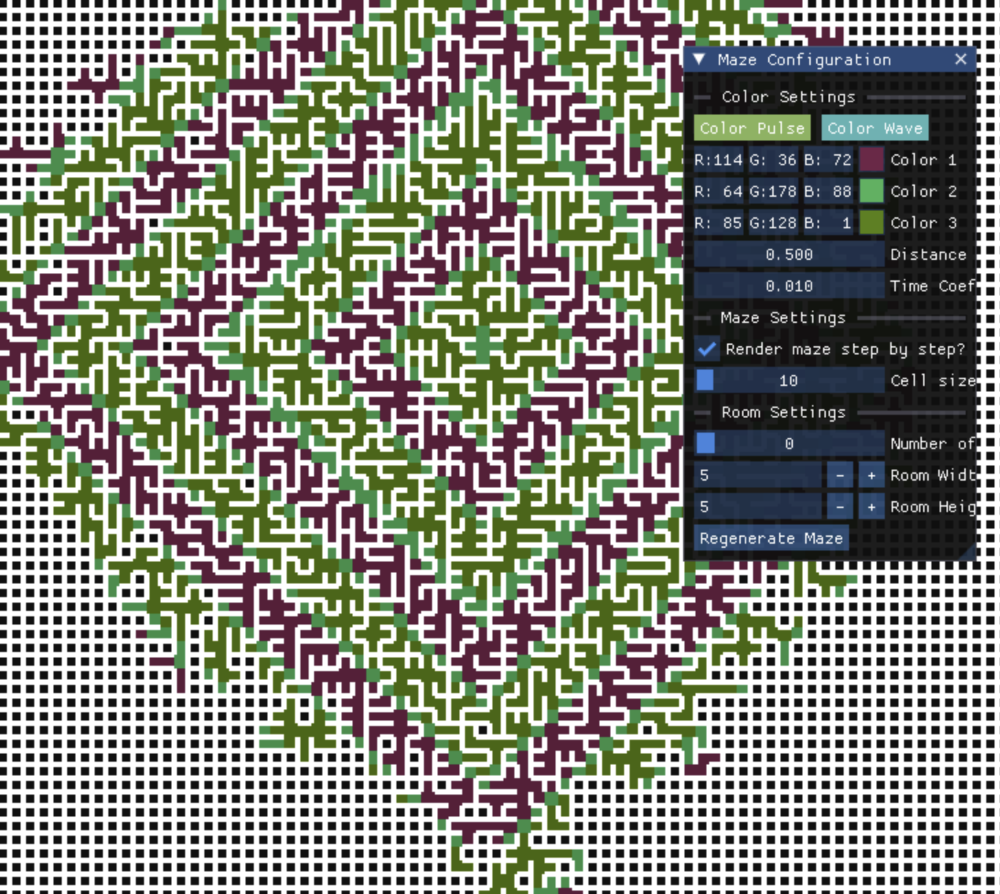

## Visualizing Mazes with Prim's Algorithm 

Prim's Algorithm is a tree-based algorithm that can be used to generate mazes. 
I added a visual simulation for it that allows you to visualize the maze generation process and mess around with colors, 
cell sizes, etc. It also allows you to add rooms. 

<div style="text-align: center;">
    
</div>
View it in the browser!:

1. [View in Browser](https://hbeadles.github.io/prims-algorithm-maze-generation/maze.html)

### Key Features

1. Visualize Maze
2. Modify settings live. I used [ImGui](https://github.com/ocornut/imgui). You can modify
   1. Colors, color waves or pulses
   2. Time / distance adjustment for color waves
   3. Cell size
   4. Room settings - number, sizes, etc

You should be able to resize the window as well. Have fun using it!

## Dependencies
This is a Cmake project, with builds for Emscripten or local stuff. I use Find_Package to pull in dependencies:
1. [SDL2](https://www.libsdl.org/)
2. [SDL2_image](https://github.com/libsdl-org/SDL_image) 
3. [SDL2_ttf](https://github.com/libsdl-org/SDL_ttf)
4. [SDL2_mixer](https://github.com/libsdl-org/SDL_mixer)

ImGUI files are included directly in the project, as per the documentation. 

### Building

Building the project is easier using the CMakePresets.json file. 


```bash
mkdir build
cd build
cmake .. -DCMAKE_BUILD_TYPE=Release
cmake --build . --config Release
```

You can also build for emscripten if you'd like:

```bash
mkdir build-web
cd build-web
emcmake cmake .. -DCMAKE_BUILD_TYPE=Release
emmake cmake --build . --config Release
```
